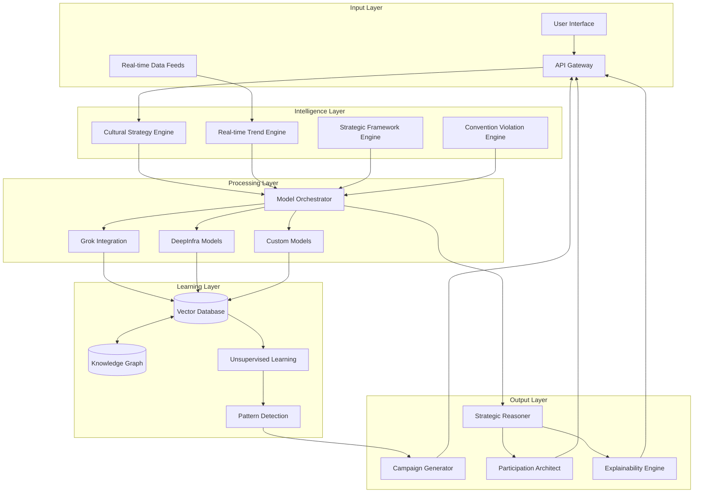
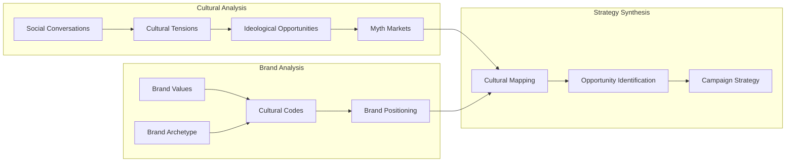
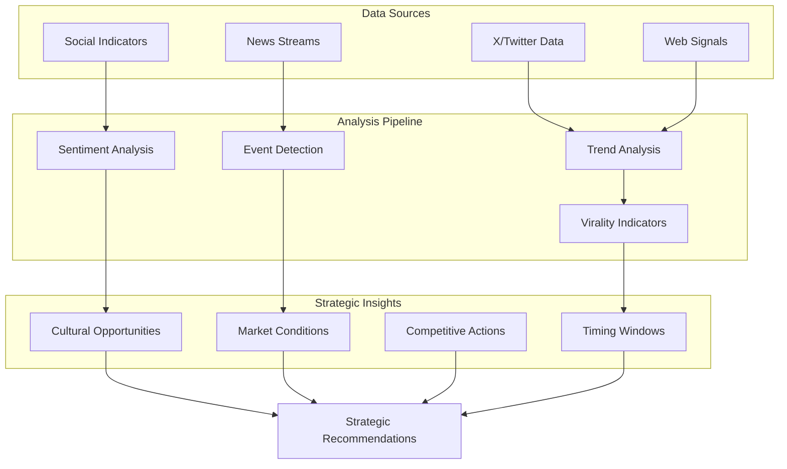
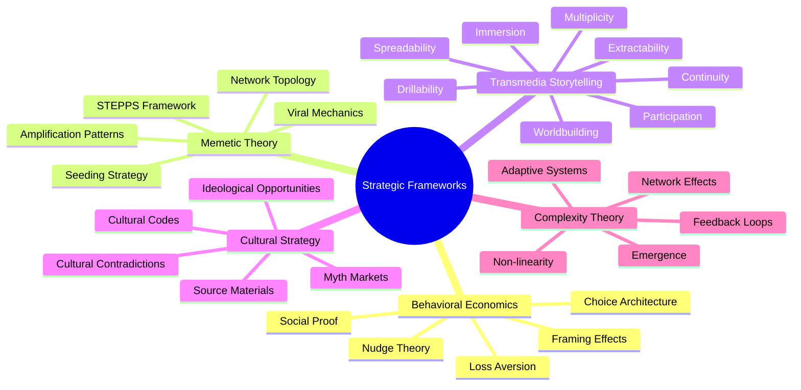
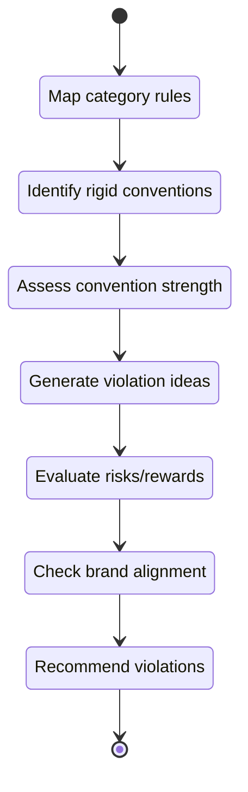
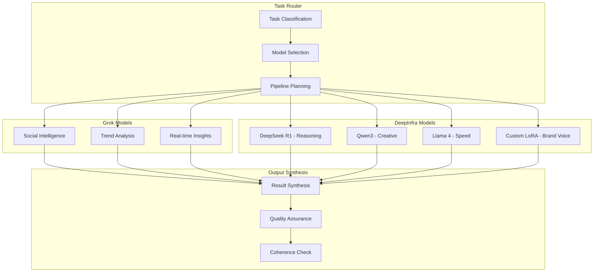
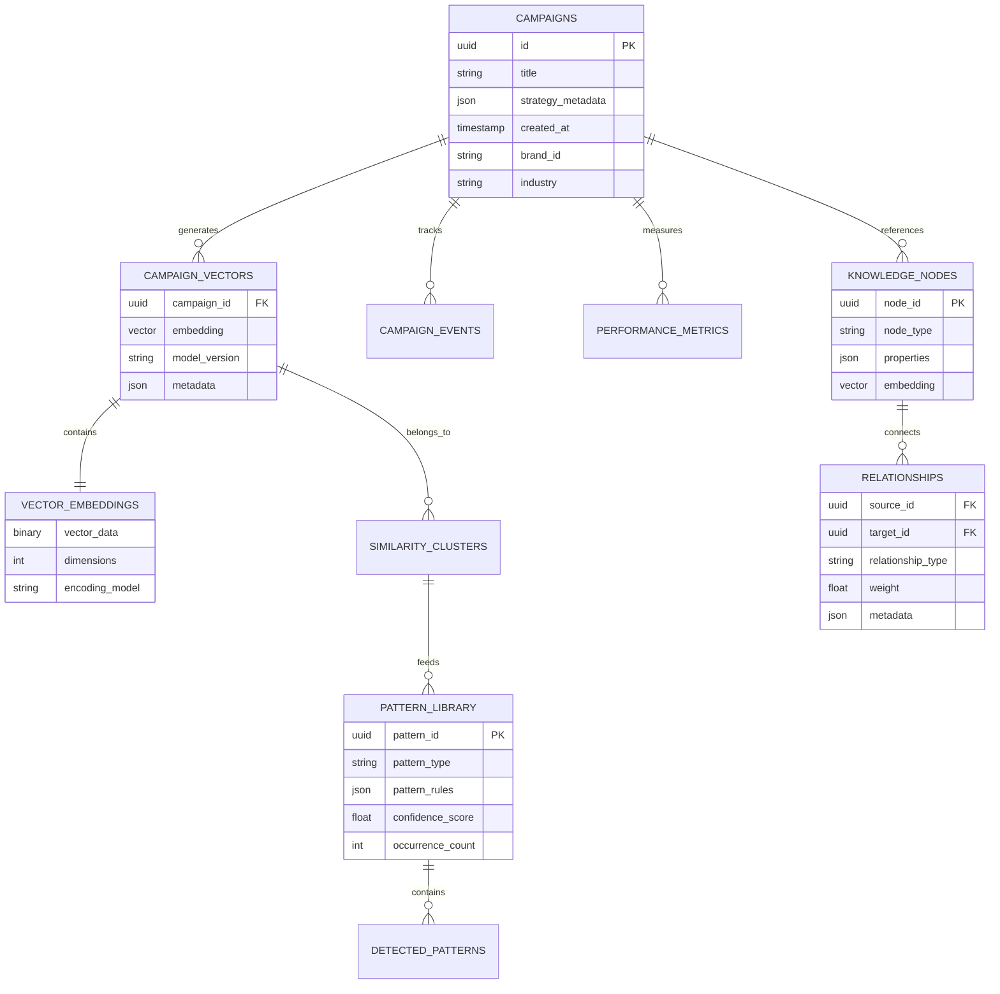
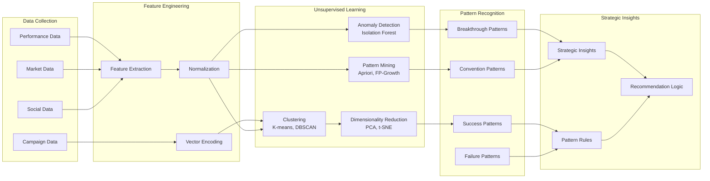
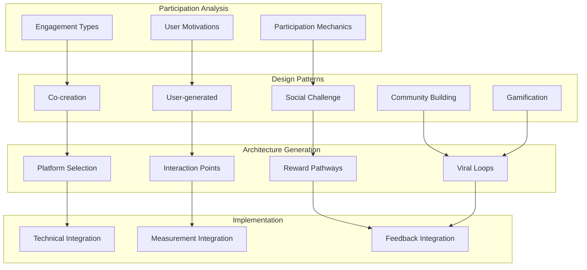
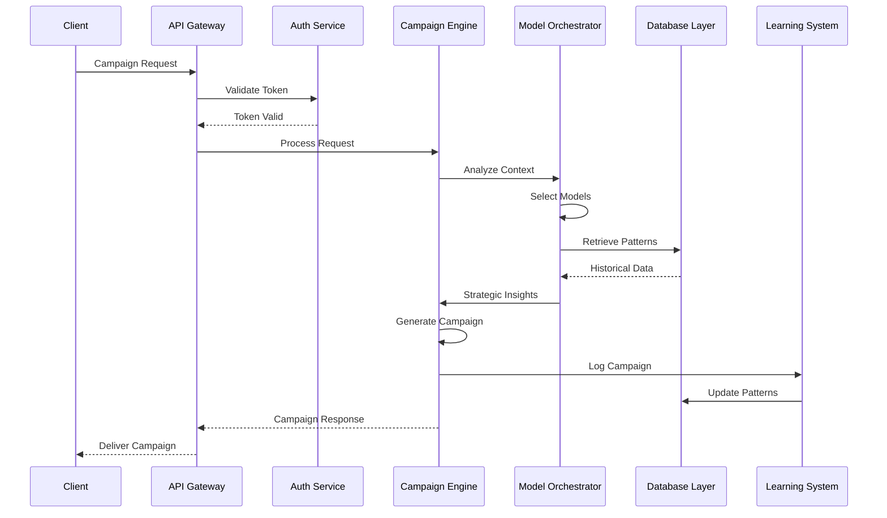

# CLAUDE.md - Kumorebe AI Campaign Generator

## Overview

Kumorebe is a first-to-market, strategy-first AI marketing campaign generator that transcends traditional content creation to deliver genuine strategic innovation. Unlike existing AI marketing tools that focus on tactical execution, Kumorebe thinks like a Chief Strategy Officer, identifying cultural tensions, violating industry conventions purposefully, and creating campaigns that invite participation rather than passive consumption.

## Core Philosophy

**"Think Strategy, Not Content"**

Kumorebe operates on the principle that breakthrough marketing campaigns emerge from:
- Strategic insight into cultural tensions
- Purposeful violation of category conventions
- Authentic alignment with brand values
- Participation architectures that engage audiences as co-creators
- Real-time adaptation to market dynamics

## System Architecture

## Core Components

### 1. Cultural Strategy Engine (CSE)
Implements Douglas Holt's cultural strategy framework to identify ideological opportunities and cultural tensions that can be leveraged for breakthrough campaigns.

### 2. Real-time Trend Engine (RTE)
Leverages Grok's access to live X data and DeepSearch capabilities for real-time social intelligence and trend detection.

### 3. Strategic Framework Engine (SFE)
Integrates advanced marketing frameworks ignored by current AI tools.

### 4. Convention Violation Engine (CVE)
Maps industry conventions and identifies strategic violation opportunities.

### 5. Model Orchestration Layer
Coordinates multiple AI models for different strategic tasks.

## Database Architecture

### Vector Database + Knowledge Graph Hybrid

## Learning Architecture

### Unsupervised Learning Pipeline

## Participation Architecture Designer

## API Structure

## Key Differentiators

### 1. Strategic Depth Over Content Volume
- Focuses on identifying breakthrough opportunities rather than generating variations
- Implements advanced marketing frameworks ignored by current tools
- Provides strategic reasoning transparency

### 2. Real-time Cultural Intelligence
- Continuous monitoring of cultural conversations via Grok
- Dynamic adaptation to emerging trends and events
- Predictive identification of cultural moments

### 3. Convention Violation as a Feature
- Maps industry rules and identifies violation opportunities
- Assesses risk/reward of convention breaking
- Ensures brand alignment with proposed violations

### 4. Participation-First Design
- Creates campaigns that invite co-creation
- Designs viral mechanics based on behavioral science
- Builds community activation strategies

### 5. Self-Improving Intelligence
- Learns from breakthrough campaigns automatically
- Identifies success patterns through unsupervised learning
- Evolves strategic recommendations based on outcomes

### 6. Model Diversity Advantage
- Leverages 100+ models through DeepInfra
- Assigns specialized models to specific tasks
- Maintains brand voice through custom LoRA models

### 7. Transparent Strategic Reasoning
- Shows step-by-step strategic logic
- Explains framework applications
- Builds marketer trust through transparency

## Implementation Priorities

### Phase 1: Foundation (Months 1-2)
- Implement core Grok integration for real-time data
- Set up DeepInfra model orchestration
- Build basic vector database architecture
- Create initial strategic framework libraries

### Phase 2: Intelligence (Months 3-4)
- Develop Cultural Strategy Engine
- Build Convention Violation Engine
- Implement pattern detection algorithms
- Create participation architecture templates

### Phase 3: Learning (Months 5-6)
- Deploy unsupervised learning pipeline
- Build knowledge graph relationships
- Implement breakthrough pattern recognition
- Create feedback loop mechanisms

### Phase 4: Scale (Months 7-8)
- Optimize model orchestration
- Enhance real-time capabilities
- Build comprehensive API
- Launch beta testing program

## Success Metrics

### Strategic Innovation
- Percentage of campaigns using novel approaches
- Convention violation success rate
- Cultural resonance scores
- Participation engagement metrics

### System Performance
- Strategy generation speed
- Model coordination efficiency
- Pattern recognition accuracy
- Learning system improvement rate

### Business Impact
- Campaign breakthrough rate
- Client retention metrics
- Strategic insight value scores
- Market differentiation index

## Conclusion

Kumorebe represents a paradigm shift in AI-powered marketing - from content generation to strategic innovation. By combining real-time cultural intelligence, advanced marketing frameworks, and self-improving learning systems, Kumorebe enables marketers to create campaigns that don't just communicate but catalyze cultural movements.